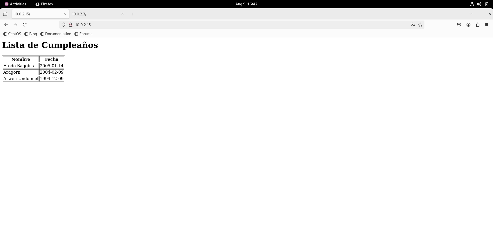

# Taller de Servidores Linux - Obligatorio Agosto 2026

Proyecto realizado para la materia **Taller de Servidores Linux**.

El objetivo es automatizar mediante Ansible el despliegue de una aplicación PHP sobre un servidor CentOS Stream y una base de datos MariaDB sobre un servidor Ubuntu Server.

---

## 1. Arquitectura

La solución utiliza dos servidores:

- `centos01` - `10.0.2.15` - CentOS Stream - servidor de aplicación.
- `ubuntu01` - `10.0.2.100` - Ubuntu Server - servidor de base de datos.

```text
centos01 (10.0.2.15)
Apache + PHP + aplicación
          |
          | TCP/3306
          v
ubuntu01 (10.0.2.100)
MariaDB
Base: cumples
Tabla: cumpleanios
```

---

## 2. Inventario

El inventario del laboratorio se encuentra en:

```text
inventory/hosts.ini
```

El laboratorio dispone de cuatro máquinas:

```ini
[centos]
centos01 ansible_host=10.0.2.15
centos02 ansible_host=10.0.2.3

[ubuntu]
ubuntu01 ansible_host=10.0.2.100
ubuntu02 ansible_host=10.0.2.101

[linux:children]
centos
ubuntu
```

Para la resolución del obligatorio se utilizaron específicamente:

```text
centos01 - 10.0.2.15  - servidor de aplicación
ubuntu01 - 10.0.2.100 - servidor de base de datos
```

Los playbooks principales están dirigidos explícitamente a estos dos hosts, por lo que `centos02` y `ubuntu02` forman parte del inventario general del laboratorio pero no intervienen en el despliegue de la solución.

---

## 3. Credenciales del laboratorio

### Acceso SSH

```text
centos01 - 10.0.2.15  - usuario: sysadmin - contraseña: aslxlab
ubuntu01 - 10.0.2.100 - usuario: sysadmin - contraseña: aslxlab
```

Ejemplos:

```bash
ssh sysadmin@10.0.2.15
ssh sysadmin@10.0.2.100
```

La contraseña utilizada para elevación de privilegios (`become`) es:

```text
aslxlab
```

### MariaDB

El servidor de base de datos utiliza dos usuarios con funciones diferentes:

```text
root      - usuario administrador de MariaDB
intranet  - usuario utilizado por la aplicación PHP
```

Datos utilizados en el laboratorio:

```text
Servidor MariaDB: 10.0.2.100
Base de datos: cumples
Usuario administrador: root
Contraseña de root: s3cret
Usuario de aplicación: intranet
Contraseña de aplicación: s3cret
```

Las variables se encuentran en:

```text
vars/database.yaml
```

El archivo está protegido mediante Ansible Vault y contiene las variables:

```yaml
DB_SERVER: 10.0.2.100
DB_ROOT_PW: s3cret
DB_USER: intranet
DB_PASS: s3cret
DB_DBASE: cumples
```

La contraseña utilizada para Ansible Vault es:

```text
s3cret
```

Para visualizar el archivo:

```bash
ansible-vault view vars/database.yaml
```

Para editarlo:

```bash
ansible-vault edit vars/database.yaml
```

---

## 4. Estructura del repositorio

```text
tallerlinux/
├── collections/
│   └── requirements.yaml
├── evidencias/
│   ├── app_funcionando_10.0.2.15.png
│   └── resultado_playbook_deploy.txt
├── files/
│   └── jail.local
├── inventory/
│   ├── group_vars/
│   │   └── linux.yaml
│   └── hosts.ini
├── playbooks/
│   ├── database.yaml
│   ├── deploy.yaml
│   ├── hardening.yaml
│   ├── validate.yaml
│   └── webserver.yaml
├── sql/
│   ├── check_table.sql
│   ├── create_table.sql
│   └── insert_data.sql
├── templates/
│   └── cumple.j2
├── vars/
│   └── database.yaml
├── README.md
└── LICENSE
```

Se creó el directorio `sql/` para mantener separados y organizados los archivos SQL utilizados por el playbook de base de datos.

---

## 5. Colecciones de Ansible

Las colecciones requeridas están declaradas en:

```text
collections/requirements.yaml
```

```yaml
---
collections:
  - community.general
  - ansible.posix
  - community.mysql
```

Para instalarlas:

**Máquina:** controlador Ansible (`localhost`)
**Directorio:** `/home/sysadmin/tallerlinux`

```bash
ansible-galaxy collection install -r collections/requirements.yaml
```

Durante las pruebas se utilizó:

```text
ansible-core 2.15.13
```

---

## 6. Playbooks

Salvo que se indique lo contrario, los comandos se ejecutan desde:

**Máquina:** controlador Ansible (`localhost`)
**Directorio:** `/home/sysadmin/tallerlinux`

### `database.yaml`

Configura MariaDB en `ubuntu01`, incluyendo la base de datos, la tabla, los datos iniciales y el usuario utilizado por la aplicación.

Ejecución:

```bash
ansible-playbook -i inventory/hosts.ini playbooks/database.yaml --ask-become-pass --ask-vault-pass
```

```text
BECOME password: aslxlab
Vault password: s3cret
```

### `webserver.yaml`

Configura `centos01` como servidor web y despliega la aplicación PHP.

Ejecución:

```bash
ansible-playbook -i inventory/hosts.ini playbooks/webserver.yaml --ask-become-pass --ask-vault-pass
```

```text
BECOME password: aslxlab
Vault password: s3cret
```

### `deploy.yaml`

Es el playbook principal y ejecuta `database.yaml` y `webserver.yaml`.

```yaml
---
- import_playbook: database.yaml
- import_playbook: webserver.yaml
```

Ejecución:

```bash
ansible-playbook -i inventory/hosts.ini playbooks/deploy.yaml --ask-become-pass --ask-vault-pass
```

```text
BECOME password: aslxlab
Vault password: s3cret
```

### `validate.yaml`

Comprueba que la solución desplegada esté funcionando correctamente.

Valida el servicio de MariaDB en `ubuntu01`, los servicios Apache y PHP-FPM en `centos01`, la conexión desde `centos01` hacia MariaDB por el puerto 3306, la respuesta HTTP de la aplicación y que se muestren los datos esperados.

Ejecución:

```bash
ansible-playbook -i inventory/hosts.ini playbooks/validate.yaml --ask-become-pass
```

```text
BECOME password: aslxlab
```

### `hardening.yaml`

Se conserva como complemento de seguridad desarrollado durante las actividades del laboratorio y no forma parte del despliegue principal.

```bash
ansible-playbook -i inventory/hosts.ini playbooks/hardening.yaml --ask-become-pass
```

```text
BECOME password: aslxlab
```

---

## 7. Procedimiento de ejecución

Todos los pasos se realizan desde:

**Máquina:** controlador Ansible (`localhost`)
**Directorio:** `/home/sysadmin/tallerlinux`

### 7.1 Instalar las colecciones

```bash
ansible-galaxy collection install -r collections/requirements.yaml
```

### 7.2 Comprobar la sintaxis del despliegue

```bash
ansible-playbook -i inventory/hosts.ini playbooks/deploy.yaml --syntax-check --ask-vault-pass
```

### 7.3 Ejecutar el despliegue completo

```bash
ansible-playbook -i inventory/hosts.ini playbooks/deploy.yaml --ask-become-pass --ask-vault-pass
```

```text
BECOME password: aslxlab
Vault password: s3cret
```

### 7.4 Ejecutar las validaciones

```bash
ansible-playbook -i inventory/hosts.ini playbooks/validate.yaml --ask-become-pass
```

```text
BECOME password: aslxlab
```

---

## 8. Validación manual de la aplicación

La aplicación puede comprobarse desde un equipo con conectividad hacia `centos01`.

Por ejemplo, desde `ubuntu01` o desde el controlador Ansible:

```bash
curl http://10.0.2.15
```

También puede abrirse desde un navegador:

```text
http://10.0.2.15
```

La respuesta debe mostrar:

```text
Frodo Baggins  - 2005-01-14
Aragorn        - 2004-02-09
Arwen Undomiel - 1994-12-09
```

---

## 9. Evidencias

### Aplicación funcionando

Evidencia visual del funcionamiento de la aplicación:




### Ejecución del playbook principal

El resultado de una ejecución del playbook principal se encuentra en:

[resultado\_playbook\_deploy.txt](evidencias/resultado_playbook_deploy.txt)

### Idempotencia

La idempotencia fue validada previamente mediante una nueva ejecución de `playbooks/deploy.yaml` sobre la infraestructura ya configurada.

En dicha ejecución, los hosts finalizaron sin cambios pendientes ni errores:

```text
centos01  changed=0  failed=0
ubuntu01  changed=0  failed=0
```

Esto confirma que, una vez alcanzado el estado requerido, el playbook reconoce la configuración existente y no realiza cambios innecesarios.
