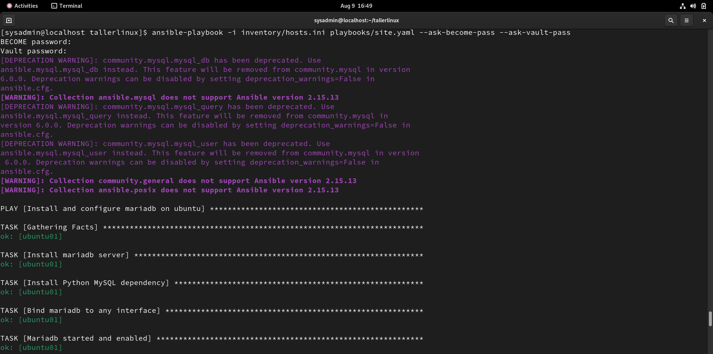
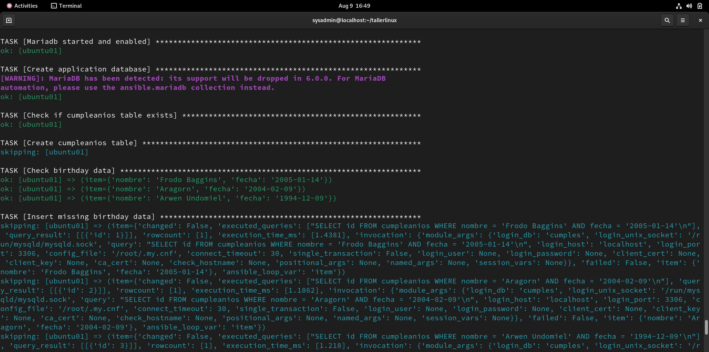
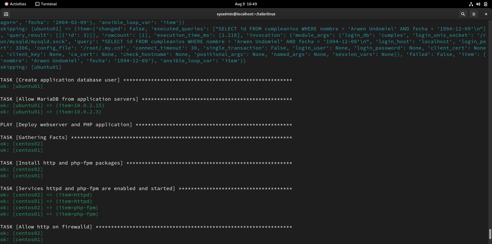
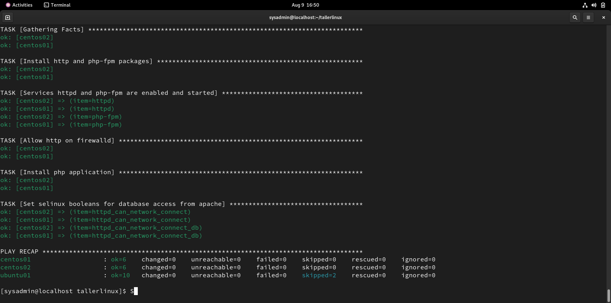

# Taller de Servidores Linux - Obligatorio Agosto 2026

Proyecto realizado para la materia Taller de Servidores Linux.

El objetivo es automatizar mediante Ansible el despliegue de una aplicación web desarrollada en PHP, utilizando un servidor CentOS Stream para Apache/PHP y un servidor Ubuntu Server para MariaDB.

La aplicación consulta de forma remota los datos almacenados en MariaDB y los muestra mediante HTTP.

---

## Arquitectura

El laboratorio utilizado está compuesto por los siguientes servidores:

| Host     | Dirección IP | Sistema       | Función                           |
|----------|--------------|---------------|-----------------------------------|
| centos01 | 10.0.2.15    | CentOS Stream | Servidor principal de aplicación |
| centos02 | 10.0.2.3     | CentOS Stream | Servidor de aplicación adicional |
| ubuntu01 | 10.0.2.100   | Ubuntu Server | Servidor de base de datos         |
| ubuntu02 | 10.0.2.101   | Ubuntu Server | Servidor Ubuntu adicional         |

El usuario utilizado por Ansible para las conexiones SSH es:

```text
sysadmin
```

La arquitectura principal de la aplicación es:

```text
centos01 (10.0.2.15) ──┐
Apache + PHP + app      │
                        ├── TCP/3306 ──> ubuntu01 (10.0.2.100)
centos02 (10.0.2.3)  ──┘                MariaDB
Apache + PHP + app                       Base: cumples
                                         Tabla: cumpleanios
```

El playbook `webserver.yaml` trabaja actualmente sobre el grupo `centos`, por lo que la aplicación también se despliega en `centos02`.

El servidor utilizado para MariaDB es `ubuntu01`.

---

## Estructura del repositorio

```text
tallerlinux/
├── collections/
│   └── requirements.yaml
├── files/
│   └── jail.local
├── evidencias/
│   ├── aplicacion-funcionando.png
│   └── idempotencia-site.png
├── inventory/
│   ├── group_vars/
│   │   └── linux.yaml
│   └── hosts.ini
├── playbooks/
│   ├── database.yaml
│   ├── hardening.yaml
│   ├── site.yaml
│   └── webserver.yaml
├── templates/
│   └── cumple.j2
├── vars/
│   └── database.yaml
├── README.md
└── LICENSE
```

---

## Inventario

El inventario se encuentra en:

```text
inventory/hosts.ini
```

Los servidores están organizados en los grupos:

```text
centos
ubuntu
linux
```

El grupo `linux` contiene como hijos a los grupos `centos` y `ubuntu`.

Las variables comunes se encuentran en:

```text
inventory/group_vars/linux.yaml
```

---

## Colecciones de Ansible

Las colecciones utilizadas por el proyecto están declaradas en:

```text
collections/requirements.yaml
```

Para el proyecto se utilizaron:

```yaml
collections:
  - community.general
  - ansible.posix
  - community.mysql
```

Para instalarlas:

```bash
ansible-galaxy collection install -r collections/requirements.yaml
```

Durante las pruebas se utilizó:

```text
ansible-core 2.15.13
```

Algunas colecciones generan advertencias de compatibilidad o deprecación con esta versión de Ansible, pero las ejecuciones realizadas finalizaron correctamente.

---

## Variables y Ansible Vault

Las variables utilizadas para la conexión entre la aplicación y MariaDB están almacenadas en:

```text
vars/database.yaml
```

El archivo se encuentra cifrado mediante Ansible Vault.

Las variables definidas son:

```yaml
DB_SERVER: 10.0.2.100
DB_USER: intranet
DB_PASS: [PROTEGIDA MEDIANTE ANSIBLE VAULT]
DB_DBASE: cumples
```

Para visualizar el archivo:

```bash
ansible-vault view vars/database.yaml
```

Para editarlo:

```bash
ansible-vault edit vars/database.yaml
```

La contraseña del usuario de MariaDB y la contraseña utilizada para abrir Ansible Vault no se almacenan en texto plano en el repositorio.

---

## Hardening de Ubuntu

El playbook:

```text
playbooks/hardening.yaml
```

realiza tareas iniciales de hardening sobre los servidores Ubuntu.

Entre las tareas implementadas se encuentran:

- Actualización de paquetes.
- Instalación y configuración de UFW.
- Política de conexiones salientes permitidas.
- Política de conexiones entrantes denegadas por defecto.
- Habilitación de SSH.
- Instalación y configuración de Fail2ban.
- Uso de `files/jail.local` para la configuración de Fail2ban.
- Inicio y habilitación de los servicios.
- Uso de handlers cuando es necesario reiniciar servicios o servidores.

La configuración personalizada de Fail2ban se encuentra en:

```text
files/jail.local
```

El hardening se ejecuta independientemente del playbook principal:

```bash
ansible-playbook -i inventory/hosts.ini playbooks/hardening.yaml --ask-become-pass
```

---

## Servidor web

El playbook:

```text
playbooks/webserver.yaml
```

configura los servidores pertenecientes al grupo `centos`.

Realiza las siguientes tareas:

- Instalación de Apache.
- Instalación de PHP.
- Instalación de PHP-FPM.
- Instalación de `php-mysqlnd` para la conexión con MariaDB.
- Inicio y habilitación de `httpd`.
- Inicio y habilitación de `php-fpm`.
- Configuración de firewalld para permitir HTTP.
- Configuración de SELinux para permitir conexiones desde Apache hacia MariaDB.
- Despliegue de la aplicación PHP.

Los booleanos de SELinux configurados son:

```text
httpd_can_network_connect
httpd_can_network_connect_db
```

---

## Aplicación PHP

La aplicación se genera a partir del template:

```text
templates/cumple.j2
```

y se despliega como:

```text
/var/www/html/index.php
```

La conexión a MariaDB se construye mediante variables de Ansible:

```php
$conexion = new mysqli(
    "{{ DB_SERVER }}",
    "{{ DB_USER }}",
    "{{ DB_PASS }}",
    "{{ DB_DBASE }}"
);
```

De esta forma, los valores de conexión no quedan definidos directamente en el template.

La aplicación consulta:

```sql
SELECT nombre, fecha
FROM cumpleanios
ORDER BY MONTH(fecha), DAY(fecha);
```

---

## Servidor de base de datos

El playbook:

```text
playbooks/database.yaml
```

configura MariaDB sobre:

```text
ubuntu01
```

Realiza las siguientes tareas:

* Instalación de MariaDB Server.
* Instalación de `python3-pymysql`.
* Configuración de MariaDB para escuchar conexiones remotas mediante `bind-address = 0.0.0.0`.
* Inicio y habilitación del servicio MariaDB.
* Creación de la base de datos utilizando `state: present`.
* Verificación de la existencia de la tabla `cumpleanios`.
* Creación de la tabla `cumpleanios` únicamente cuando no existe.
* Verificación de los datos iniciales antes de realizar su inserción.
* Carga únicamente de los registros que todavía no existen, evitando datos duplicados.
* Creación del usuario utilizado por la aplicación mediante `state: present`.
* Asignación de permisos de lectura sobre la base de datos.
* Configuración de UFW para permitir conexiones TCP/3306 únicamente desde los servidores de aplicación `centos01` y `centos02`.
* Uso de un handler para reiniciar MariaDB únicamente cuando se modifica su configuración.

MariaDB se configura con:

```text
bind-address = 0.0.0.0
```

El servicio queda escuchando en:

```text
0.0.0.0:3306
```

---

## Base de datos

La base utilizada por la aplicación es:

```text
cumples
```

La tabla utilizada es:

```text
cumpleanios
```

Su estructura es:

```sql
CREATE TABLE cumpleanios (
  id INT AUTO_INCREMENT PRIMARY KEY,
  nombre VARCHAR(100),
  fecha DATE
);
```

Los datos iniciales son:

| id | nombre         | fecha      |
|----|----------------|------------|
| 1  | Frodo Baggins  | 2005-01-14 |
| 2  | Aragorn        | 2004-02-09 |
| 3  | Arwen Undomiel | 1994-12-09 |

---

## Idempotencia de la base de datos

Antes de crear la tabla, el playbook verifica si `cumpleanios` ya existe.

Si existe:

```text
Create cumpleanios table → skipping
```

Antes de insertar cada registro inicial también se comprueba si ya existe.

Si el registro está cargado:

```text
Insert missing birthday data → skipping
```

Esto evita crear nuevamente la tabla o duplicar los datos en ejecuciones posteriores.

La creación de la base y del usuario utiliza módulos específicos de Ansible con:

```yaml
state: present
```

por lo que tampoco se vuelven a crear si ya existen con la configuración esperada.

---

## Usuario de MariaDB

La aplicación utiliza el usuario definido mediante:

```text
DB_USER
```

Actualmente corresponde a:

```text
intranet
```

El usuario está configurado para conexiones remotas:

```text
intranet@%
```

y posee únicamente permisos de lectura sobre la base de la aplicación:

```sql
GRANT SELECT ON `cumples`.* TO `intranet`@`%`;
```

La contraseña se encuentra protegida mediante Ansible Vault.

---

## Firewall

### CentOS

Los servidores de aplicación utilizan `firewalld`.

Se permite el acceso HTTP necesario para publicar la aplicación.

### Ubuntu

El servidor de base de datos utiliza UFW.

El acceso a MariaDB por TCP/3306 se encuentra restringido exclusivamente a los servidores de aplicación:

```text
10.0.2.15 - centos01
10.0.2.3  - centos02
```

La configuración validada de UFW es:

```text
OpenSSH     ALLOW    Anywhere
3306/tcp    ALLOW    10.0.2.15
3306/tcp    ALLOW    10.0.2.3
OpenSSH(v6) ALLOW    Anywhere (v6)
```

No existe una regla `3306/tcp ALLOW Anywhere`, por lo que otros equipos del laboratorio no pueden acceder directamente al puerto de MariaDB.

---

## Playbook principal

El playbook principal es:

```text
playbooks/site.yaml
```

Su función es ejecutar de forma centralizada el despliegue de la solución:

```yaml
---
- import_playbook: database.yaml
- import_playbook: webserver.yaml
```

El orden es:

```text
site.yaml
   |
   +-- database.yaml
   |      |
   |      +-- MariaDB
   |      +-- base cumples
   |      +-- tabla cumpleanios
   |      +-- datos iniciales
   |      +-- usuario intranet
   |
   +-- webserver.yaml
          |
          +-- Apache
          +-- PHP
          +-- aplicación
          +-- firewalld
          +-- SELinux
```

El hardening se mantiene como un playbook independiente.

---

## Prerrequisitos de ejecución

Antes de ejecutar la automatización se requiere:

- Un equipo controlador con Ansible instalado.
- Conectividad SSH desde el controlador hacia los servidores del inventario.
- El usuario `sysadmin` disponible en los equipos administrados.
- La contraseña de elevación de privilegios (`become`).
- La contraseña utilizada para abrir `vars/database.yaml` mediante Ansible Vault.
- Las colecciones declaradas en `collections/requirements.yaml`.

---

## Ejecución

Todos los comandos deben ejecutarse desde la raíz del repositorio.

### Instalar las colecciones

```bash
ansible-galaxy collection install -r collections/requirements.yaml
```

### Comprobar conectividad

```bash
ansible all -i inventory/hosts.ini -m ping
```

### Comprobar sintaxis del playbook principal

```bash
ansible-playbook -i inventory/hosts.ini playbooks/site.yaml --syntax-check --ask-vault-pass
```

### Desplegar la solución completa

```bash
ansible-playbook -i inventory/hosts.ini playbooks/site.yaml --ask-become-pass --ask-vault-pass
```

Ansible solicitará:

1. La contraseña para elevación de privilegios.
2. La contraseña de Ansible Vault.

---

## Validaciones

### Estado de MariaDB

En `ubuntu01` se valida que el servicio MariaDB se encuentre activo y habilitado:

```bash
systemctl status mariadb
```

Resultado obtenido:

```text
● mariadb.service - MariaDB 10.11.14 database server
Loaded: loaded (/usr/lib/systemd/system/mariadb.service; enabled; preset: enabled)
Active: active (running) since Sun 2026-08-09 18:45:51 UTC
Main PID: 1001 (mariadbd)
Status: "Taking your SQL requests now..."
```

Esto confirma que el servicio se encuentra en ejecución y habilitado para iniciar automáticamente.

También se valida que MariaDB esté escuchando en el puerto TCP/3306:

```bash
sudo ss -lntp | grep 3306
```

Resultado obtenido:

```text
LISTEN 0 80 0.0.0.0:3306 0.0.0.0:* users:(("mariadbd",pid=1001,fd=25))
```

El resultado `0.0.0.0:3306` confirma que MariaDB se encuentra escuchando conexiones en todas las interfaces de red.

### UFW

Se valida la configuración del firewall:

```bash
sudo ufw status
```

Resultado obtenido:

```text
Status: active

To                         Action      From
--                         ------      ----
OpenSSH                    ALLOW       Anywhere
3306/tcp                   ALLOW       10.0.2.15
3306/tcp                   ALLOW       10.0.2.3
OpenSSH (v6)               ALLOW       Anywhere (v6)
```

Esto confirma que el puerto `3306/tcp` solamente está habilitado para los servidores de aplicación:

* `centos01`: `10.0.2.15`
* `centos02`: `10.0.2.3`

### Base de datos

Se ingresa al monitor de MariaDB:

```bash
sudo mariadb
```

La conexión se realiza correctamente:

```text
Welcome to the MariaDB monitor.
Server version: 10.11.14-MariaDB-0ubuntu0.24.04.1 Ubuntu 24.04
```

#### Validación de la base de datos

```sql
SHOW DATABASES;
```

Resultado obtenido:

```text
+--------------------+
| Database           |
+--------------------+
| cumples            |
| information_schema |
| mysql              |
| performance_schema |
| sys                |
+--------------------+
```

Esto confirma que la base de datos `cumples` fue creada correctamente.

#### Validación de la tabla

Primero se selecciona la base de datos:

```sql
USE cumples;
```

Luego se consultan las tablas existentes:

```sql
SHOW TABLES;
```

Resultado obtenido:

```text
+-------------------+
| Tables_in_cumples |
+-------------------+
| cumpleanios       |
+-------------------+
```

Esto confirma la existencia de la tabla `cumpleanios`.

#### Validación de los registros

```sql
SELECT * FROM cumpleanios;
```

Resultado obtenido:

```text
+----+----------------+------------+
| id | nombre         | fecha      |
+----+----------------+------------+
|  1 | Frodo Baggins  | 2005-01-14 |
|  2 | Aragorn        | 2004-02-09 |
|  3 | Arwen Undomiel | 1994-12-09 |
+----+----------------+------------+
```

Se confirma que los tres registros iniciales fueron cargados correctamente.

#### Validación del usuario de la aplicación

```sql
SELECT User, Host
FROM mysql.user
WHERE User = 'intranet';
```

Resultado obtenido:

```text
+----------+------+
| User     | Host |
+----------+------+
| intranet | %    |
+----------+------+
```

Esto confirma que el usuario `intranet` existe y puede autenticarse desde hosts remotos.

#### Validación de permisos

```sql
SHOW GRANTS FOR 'intranet'@'%';
```

Resultado obtenido:

```text
GRANT USAGE ON *.* TO `intranet`@`%`
GRANT SELECT ON `cumples`.* TO `intranet`@`%`
```

Esto confirma que el usuario `intranet` posee permisos de lectura (`SELECT`) sobre la base de datos `cumples`, sin permisos de modificación sobre los datos.

---

## Validación de la aplicación

Desde un equipo con conectividad hacia los servidores se realizaron consultas HTTP contra ambos servidores de aplicación.

### Validación de `centos01`

```bash
curl http://10.0.2.15
```

Resultado obtenido:

```html
<h1>Lista de Cumpleaños</h1>
<table border='1'>
<tr><th>Nombre</th><th>Fecha</th></tr>
<tr><td>Frodo Baggins</td><td>2005-01-14</td></tr>
<tr><td>Aragorn</td><td>2004-02-09</td></tr>
<tr><td>Arwen Undomiel</td><td>1994-12-09</td></tr>
</table>
```

### Validación de `centos02`

```bash
curl http://10.0.2.3
```

Resultado obtenido:

```html
<h1>Lista de Cumpleaños</h1>
<table border='1'>
<tr><th>Nombre</th><th>Fecha</th></tr>
<tr><td>Frodo Baggins</td><td>2005-01-14</td></tr>
<tr><td>Aragorn</td><td>2004-02-09</td></tr>
<tr><td>Arwen Undomiel</td><td>1994-12-09</td></tr>
</table>
```

También se puede acceder a ambos servidores desde un navegador:

```text
http://10.0.2.15
http://10.0.2.3
```

Ambos servidores respondieron correctamente mediante HTTP y mostraron los mismos datos almacenados en MariaDB:

| Nombre         | Fecha      |
| -------------- | ---------- |
| Frodo Baggins  | 2005-01-14 |
| Aragorn        | 2004-02-09 |
| Arwen Undomiel | 1994-12-09 |

Esto confirma que tanto `centos01` como `centos02` pueden conectarse correctamente al servidor de base de datos `ubuntu01`, consultar la tabla `cumples.cumpleanios` y presentar los resultados mediante Apache y PHP.

El flujo validado es:

```text
Cliente
   |
   | HTTP
   v
centos01 / centos02
Apache + PHP
   |
   | TCP/3306
   v
MariaDB - ubuntu01
   |
   v
cumples.cumpleanios
```

---

## Evidencia de funcionamiento

La aplicación fue probada mediante HTTP en ambos servidores de aplicación:

```text
http://10.0.2.15
http://10.0.2.3
```

Las pruebas con `curl` devolvieron correctamente el contenido de la aplicación desde ambos servidores. La página mostró los tres registros almacenados en la base de datos MariaDB remota:

```text
Frodo Baggins  - 2005-01-14
Aragorn        - 2004-02-09
Arwen Undomiel - 1994-12-09
```

### Aplicación funcionando en `centos01` - `10.0.2.15`


### Aplicación funcionando en `centos02` - `10.0.2.3`


Esto comprueba que:

- Apache está funcionando.
- PHP está funcionando.
- MariaDB está funcionando.
- La conexión entre CentOS y Ubuntu es remota.
- El usuario de la aplicación puede consultar la base.
- Los datos son recuperados desde MariaDB y mostrados por PHP.

---

## Evidencia de idempotencia

Luego de completar la configuración definitiva, incluyendo las reglas de UFW restringidas a los servidores de aplicación, se ejecutó nuevamente el playbook principal sin realizar modificaciones previas:

```bash
ansible-playbook -i inventory/hosts.ini playbooks/site.yaml --ask-become-pass --ask-vault-pass
```

El resultado fue:

```text
PLAY RECAP

centos01 : ok=6  changed=0  unreachable=0  failed=0  skipped=0
centos02 : ok=6  changed=0  unreachable=0  failed=0  skipped=0
ubuntu01 : ok=10 changed=0  unreachable=0  failed=0  skipped=2
```

La segunda ejecución no realizó cambios innecesarios:

```text
changed=0
failed=0
```

Las tareas de creación de la tabla y carga de datos fueron omitidas porque los elementos ya existían.

### Evidencias de idempotencia









---

## Git

El proyecto se encuentra versionado mediante Git.

El desarrollo se realizó mediante commits progresivos para registrar las diferentes etapas de implementación.

Entre las etapas registradas se encuentran:

- Configuración inicial del proyecto.
- Hardening y Fail2ban.
- Configuración de Ansible Vault.
- Despliegue del servidor web.
- Configuración de MariaDB.
- Creación de base, usuario, tabla y datos.
- Implementación de validaciones para evitar duplicados.
- Incorporación del playbook principal.

La rama utilizada para el desarrollo final es:

```text
main
```

---

## Resultado final

Actualmente la solución permite desplegar mediante Ansible:

### CentOS

- Apache.
- PHP.
- PHP-FPM.
- Extensión para MariaDB.
- Aplicación PHP.
- Firewalld.
- Configuración SELinux.

### Ubuntu

- MariaDB Server.
- Servicio MariaDB.
- Conexiones remotas.
- Base `cumples`.
- Tabla `cumpleanios`.
- Datos iniciales.
- Usuario `intranet`.
- Permisos de lectura.
- UFW con TCP/3306 restringido a `centos01` y `centos02`.

### Ansible

- Inventario organizado en grupos.
- Variables comunes.
- Variables sensibles protegidas con Ansible Vault.
- Colecciones declaradas mediante `requirements.yaml`.
- Uso de módulos específicos.
- Handlers.
- Playbook principal.
- Validaciones.
- Ejecución idempotente.